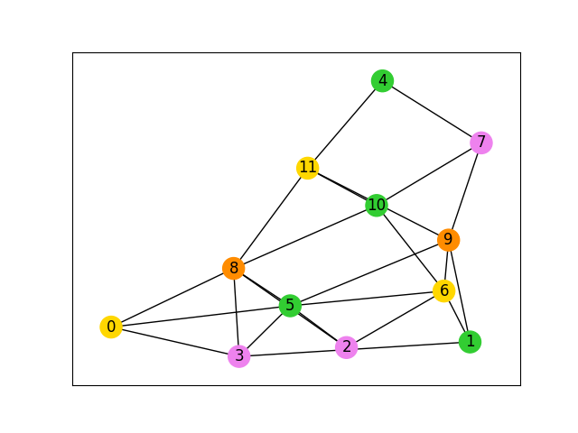

# グラフ彩色問題

こちらでは、[Lucas, 2014, "Ising formulations of many NP problems"](https://doi.org/10.3389/fphy.2014.00005)の 6.1. Graph Coloring を OpenJij と [JijModeling](https://www.ref.documentation.jijzept.com/jijmodeling/)、そして[JijModeling transpiler](https://www.ref.documentation.jijzept.com/jijmodeling-transpiler/) を用いて解く方法をご紹介します。

## 概要: グラフ彩色問題とは

グラフ彩色問題とは、あるグラフ上の辺で繋がれた頂点どうしを異なる色になるように彩色する問題です。NP完全な問題として知られています。

### 具体例

下図のように6個の頂点といくつかの辺からなる無向グラフが与えられたとしましょう。


これを3色で全ての頂点を塗り分けると以下のようになります。


全ての辺において、その両端に位置する頂点は異なる色で塗り分けられていることがわかります。

### 問題の一般化

それではこの問題を一般化し、数式で表現してみましょう。無向グラフ$G = (V, E)$を、辺で結ばれた頂点の色が重複しないように$N$色で塗り分けることを考えます。
頂点の色分けをバイナリ変数$x_{v, n}$で表すことにします。$v$番目の頂点を$n$の色で塗り分けるとき、$x_{v, n} = 1$、それ以外では$x_{v, n} = 0$となります。  

**制約: 頂点はどれか一色で塗り分けなければならない**

例えば、青色と緑色の2色で1つの頂点を塗ることは許されません。これを数式で表現すると、以下のようになります。


$$
\nonumber
\sum_{n=0}^{N-1} x_{v, n} = 1 \quad (\forall n \in \{ 0, 1, \dots, N-1 \}) 
$$ (1)

**目的関数: 同じ色の頂点を両端に持つ辺の数を最小にする**

グラフ彩色問題の問題設定から、全ての辺の両端の頂点が異なる色で塗り分けられる必要があります。これを数式で表現すると

$$
\nonumber
\min \quad \sum_{n=0}^{N-1} \sum_{(uv) \in E} x_{u, n} x_{v, n}  
$$ (2)

もし、全ての辺の両端の頂点が異なる色で塗り分けられているなら、この目的関数値はゼロとなります。

## JijModelingによるモデル構築

### ナップサック問題で用いる変数を定義

式(1), (2)で用いられている変数を、以下のようにして定義しましょう。

```python
import jijmodeling as jm


# define variables
V = jm.Placeholder('V')
E = jm.Placeholder('E', dim=2)
N = jm.Placeholder('N')
x = jm.Binary('x', shape=(V, N))
n = jm.Element('i', (0, N))
v = jm.Element('v', (0, V))
e = jm.Element('e', E)
```

`V=jm.Placeholder('V')`でグラフの頂点数、`E=jm.Placeholder('E', dim=2)`でグラフの辺集合を定義します。`N=jm.Placeholder('N')`でグラフを塗り分ける色数を定義し、その`V, N`を用いてバイナリ変数$x_{v, n}$を`x=jm.Binary('x', shape=(V, N))`のように定義します。`n, v`はバイナリ変数の添字に用いる変数です。最後の`e`は辺を表す変数です。`e[0], e[1]`が辺`e`の両端に位置する頂点となります。すなわち$(uv) = (e[0] e[1])$です。

### 制約の追加

式(1)を制約として実装します。

```python
# set problem
problem = jm.Problem('Graph Coloring')
# set one-hot constraint that each vertex has only one color
const = x[v, :]
problem += jm.Constraint('color', const==1, forall=v)
```

問題を作成し、そこに制約を追加しましょう。`x[v, :]`とすることで`Sum(n, x[v, n])`を簡潔に実装することができます。

### 目的関数の追加

式(2)の目的関数を実装しましょう。

```python
# set objective function: minimize edges whose vertices connected by edges are the same color
sum_list = [n, e]
problem += jm.Sum(sum_list, x[e[0], n]*x[e[1], n])
```

`sum_list=[n, e], jm.Sum(sum_list, ...)`とすることで、$\sum_n \sum_e$を表現することができます。`x[e[0], n]`は$x_{e[0], n}$、`x[e[1], n]`は$x_{e[1], n}$を表していいます。

実際に実装された数式をJupyter Notebookで表示してみましょう。


### インスタンスの作成

実際にグラフ彩色を行うグラフを設定しましょう。

```python
# set the number of vertices
inst_V = 12
# set the number of colors
inst_N = 4
# create a random graph
inst_G = nx.gnp_random_graph(inst_V, 0.4)
# get information of edges
inst_E = [list(edge) for edge in inst_G.edges]
instance_data = {'V': inst_V, 'N': inst_N, 'E': inst_E, 'G': inst_G}
```

今回はグラフの頂点数を12個、グラフを塗り分ける色数を4つとします。

### 未定乗数の設定

グラフ彩色問題には制約が一つあります。よってその制約の重みを設定する必要があります。
先程の`Constraint`部分で付けた名前と一致させるように、辞書型を用いて設定を行います。

```python
# set multipliers
lam1 = 1.0
multipliers = {'color': lam1}    
```

### JijModeling transpilerによるPyQUBOへの変換

ここまで行われてきた実装は、全てJijModelingによるものでした。
これを[PyQUBO](https://pyqubo.readthedocs.io/en/latest/)に変換することで、OpenJijはもちろん、他のソルバーを用いた組合せ最適化計算を行うことが可能になります。

```python
from jijmodeling.transpiler.pyqubo import to_pyqubo

# convert to pyqubo
pyq_model, pyq_chache = to_pyqubo(problem, instance_data, {})
qubo, bias = pyq_model.compile().to_qubo(feed_dict=multipliers)
```

JijModelingで作成された`problem`、そして先ほど値を設定した`instance_data`を引数として、`to_pyqubo`によりPyQUBOモデルを作成します。次にそれをコンパイルすることで、OpenJijなどで計算が可能なQUBOモデルにします。

### OpenJijによる最適化計算の実行

今回はOpenJijのシミュレーテッド・アニーリングを用いて、最適化問題を解くことにします。
それには以下のようにします。

```python
# set sampler
sampler = oj.SASampler()
# solve problem
response = sampler.sample_qubo(qubo)
```    

`SASampler`を設定し、そのサンプラーに先程作成したQUBOモデルの`qubo`を入力することで、計算結果が得られます。

### デコードと解の表示

返された計算結果をデコードし、解析を行いやすくします。

```python
# decode solution
result = pyq_chache.decode(response)
```

このようにして得られた結果から、グラフ彩色された結果を見てみましょう。

```python
# get indices of x = 1
indices, _, _ = result.record.solution['x'][0]
# get vertex number and color
vertices, colors = indices
# sort lists by vertex number
zip_lists = zip(vertices, colors)
zip_sort = sorted(zip_lists)
sorted_vertices, sorted_colors = zip(*zip_sort)
# initialize vertex color list
node_colors = [-1] * len(vertices)
# set color list for visualization
colorlist = ['gold', 'violet', 'limegreen', 'darkorange']
# set vertex color list
for i, j in zip(sorted_vertices, sorted_colors):
    node_colors[i] = colorlist[j]
# make figure
fig = plt.figure()
nx.draw_networkx(instance_data['G'], node_color=node_colors, with_labels=True)
fig.savefig('graph_coloring.png')
```

すると以下のような画像を得ます。


